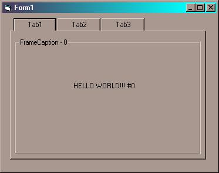



## Create your own tabbed dialog\.

### Description

Demonstrates how you can create your own tabbed dialogs without the use of any OCXs or API.

Only 2.8 KB to download! This code is HEAVILY COMMENTED, and explains in plain english what every little line does, this example includes 3 tabs, you can customize each tab, and you can add more tabs. IF YOU LIKE IT, PLEASE VOTE FOR IT! I would greatly appriciate any comments or suggestions which you can place by scrolling down this page some.
 
### More Info
 
All of the instructions on using this code have been put into the code itself.

             |
---                |---
**Submitted On**   |1999-10-19 18:51:46
**By**             |[\(Tim Miron\) yar\-interactive software](https://github.com/Planet-Source-Code/PSCIndex/blob/master/ByAuthor/tim-miron-yar-interactive-software.md)
**Level**          |Beginner
**User Rating**    |4.5 (50 globes from 11 users)
**Compatibility**  |VB 5\.0, VB 6\.0
**Category**       |[Custom Controls/ Forms/  Menus](https://github.com/Planet-Source-Code/PSCIndex/blob/master/ByCategory/custom-controls-forms-menus__1-4.md)
**World**          |[Visual Basic](https://github.com/Planet-Source-Code/PSCIndex/blob/master/ByWorld/visual-basic.md)
**Archive File**   |[CODE\_UPLOAD1080210192000\.zip](https://github.com/Planet-Source-Code/tim-miron-yar-interactive-software-create-your-own-tabbed-dialog__1-12167/archive/master.zip)

